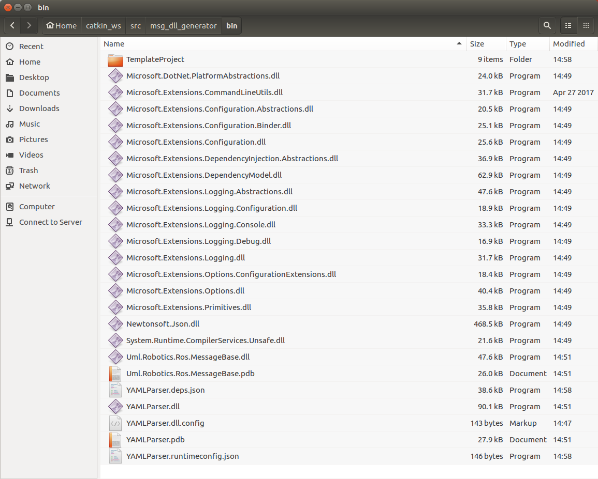

# msg_dll_generator
A ROS Package with a C# msg generator. Kind of like genpy/gencpp/genlisp, but a lot more hacky, and certainly unofficial

## How to install
### Install .NET Core SDK 2.1
Instructions can be found on [Microsoft's website](https://www.microsoft.com/net/download). Linux version must be 64-bit.

### Clone the project
- `cd ~/catkin_ws/src`
- `git clone https://github.com/YaseenAlk/msg_dll_generator.git`

If successful, repo should be cloned to `~/catkin_ws/src/msg_dll_generator/`

### Initialize the submodule:
- If not already in repo folder, `cd ~/catkin_ws/src/msg_dll_generator/`
- `git submodule update --init`

### Update the submodule
- If not already in repo folder, `cd ~/catkin_ws/src/msg_dll_generator/`
- `git submodule update --remote`

### Build YAMLParser.dll

YAMLParser is a C# program that autogenerates C# projects for .msg/.srv/action files.
- If not already in repo folder, `cd ~/catkin_ws/src/msg_dll_generator/`
- `./rebuild_yamlparser.sh`

If you have now have a folder in `~/catkin_ws/src/msg_dll_generator/bin/` filled with the following files, then you're good:

You should now be able to run the following script in terminal:

`~/catkin_ws/src/msg_dll_generator/catkin_make_with_dll`

and that script should be able to autogenerate a .NET Core dll package in the folder `~/catkin_ws/src/msg_dll_generator/catkin_make_with_dll/autogenerated_msg_dll`. The three files in this folder can now be used as a C# library anywhere: in unity, in other C# projects, etc.

### (Optional) Add `catkin_make_dll` command to `.bashrc`
- `cd ~`
- `nano .bashrc`
- Add the following line to the `.bashrc` file:

`alias catkin_make_dll = '~/catkin_ws/src/msg_dll_generator/catkin_make_with_dll'`
- Save your `.bashrc` file and restart terminal

You should now be able to run the command `catkin_make_dll` in any directory in terminal! Woohoo! :D

---

Now it's ready to use!
